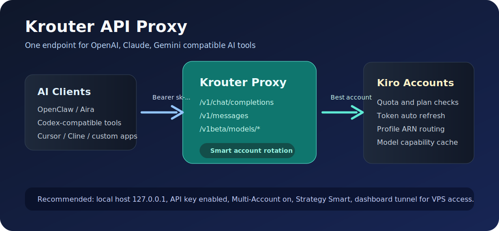
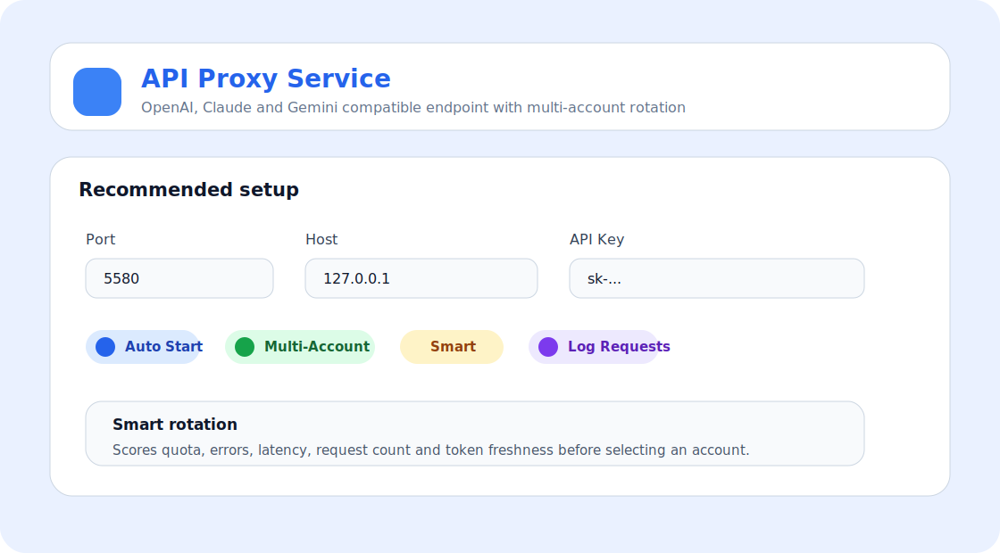
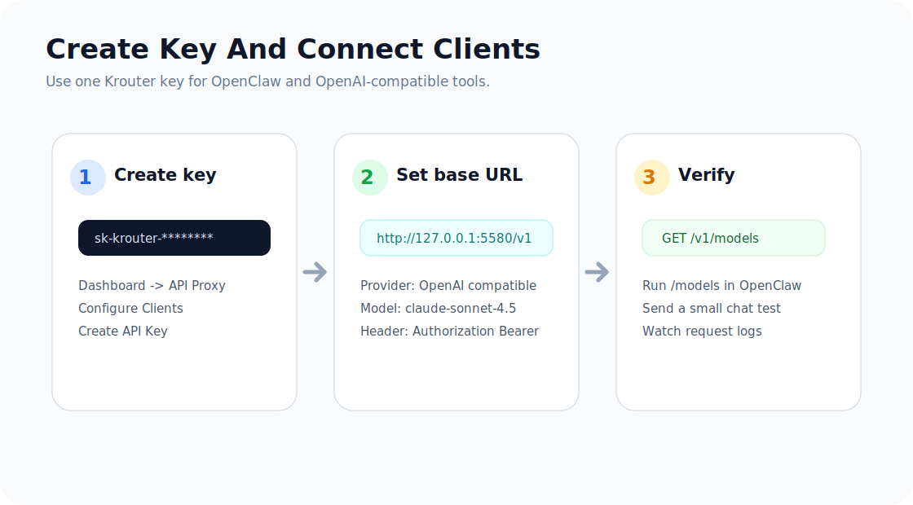

# Hướng Dẫn Dịch Vụ API Proxy Của Krouter

Krouter API Proxy tạo một endpoint tương thích OpenAI, Claude và Gemini để các công cụ AI gọi vào một nơi duy nhất. Backend sẽ tự chọn tài khoản Kiro phù hợp, làm mới token khi cần, kiểm tra model, ghi log và xoay tài khoản theo cấu hình.



## 1. Cài Đặt Và Mở Dashboard

Cài hoặc cập nhật Krouter:

```bash
npm install -g @lightharu/krouter
```

Mở CLI:

```bash
krouter
```

CLI sẽ khởi động backend, mở dashboard local và hiển thị địa chỉ truy cập. Mặc định:

```text
Dashboard: http://127.0.0.1:4010
API Proxy: http://127.0.0.1:5580/v1
```

Nếu chạy trên VPS, dùng tunnel dashboard thay vì mở HTTP public trực tiếp:

```bash
krouter tunnel start
```

## 2. Chuẩn Bị Tài Khoản Kiro

Vào **Tài khoản** và nhập các tài khoản Kiro hợp lệ. Sau đó bấm **Làm mới / kiểm tra** để backend lấy quota, subscription, token và profile ARN.

Lưu ý về ARN:

- Tài khoản Enterprise/Power có thể có ARN thật riêng.
- Tài khoản GitHub/Google social thường dùng ARN social cố định.
- Tài khoản Builder ID có thể dùng placeholder ARN tương thích. Nếu model không nhận tài khoản đó, proxy sẽ chuyển sang tài khoản khác khi bật multi-account.

## 3. Bật API Proxy

Vào **API Proxy Service**.



Thiết lập khuyến nghị:

| Mục | Giá trị khuyến nghị |
| --- | --- |
| Host | `127.0.0.1` nếu chỉ dùng local |
| Port | `5580` |
| Auto Start | Bật nếu muốn service tự chạy lại sau restart |
| Multi-Account | Bật |
| Strategy | `Smart` |
| Log Requests | Bật khi đang test, có thể tắt khi chạy ổn |
| Max Retries | `3` hoặc cao hơn nếu mạng không ổn |
| Disable Tools | Tắt nếu dùng agent/dev task cần tool calls |

Chiến lược **Smart** sẽ ưu tiên tài khoản còn quota, ít lỗi, ít request, latency tốt và token chưa gần hết hạn. Khi tài khoản lỗi quota/rate-limit/suspended, proxy đánh dấu trạng thái rồi tự chọn tài khoản khác.

## 4. Tạo API Key Cho Client

Trong **API Proxy Service**, bấm **Configure Clients** hoặc **Configure API Keys**, tạo key dạng `sk-...`.



Client sẽ gọi bằng header:

```text
Authorization: Bearer sk-...
```

Không public API Proxy ra internet nếu chưa có API key và rule bảo mật.

## 5. Endpoint Cho Các Client AI

### OpenAI Compatible

```text
Base URL: http://127.0.0.1:5580/v1
Chat:     POST /v1/chat/completions
Models:   GET  /v1/models
```

Ví dụ:

```bash
curl http://127.0.0.1:5580/v1/chat/completions \
  -H "Authorization: Bearer sk-..." \
  -H "Content-Type: application/json" \
  -d '{
    "model": "claude-sonnet-4.5",
    "messages": [{"role": "user", "content": "Reply pong"}],
    "stream": false
  }'
```

### Claude Compatible

```text
Base URL: http://127.0.0.1:5580
Messages: POST /v1/messages
```

Ví dụ:

```bash
curl http://127.0.0.1:5580/v1/messages \
  -H "Authorization: Bearer sk-..." \
  -H "Content-Type: application/json" \
  -d '{
    "model": "claude-sonnet-4.5",
    "max_tokens": 256,
    "messages": [{"role": "user", "content": "Reply pong"}],
    "stream": false
  }'
```

### Gemini Compatible

```text
Base URL: http://127.0.0.1:5580
Models:   GET  /v1beta/models
Generate: POST /v1beta/models/{model}:generateContent
```

## 6. Kết Nối OpenClaw

Cách nhanh nhất:

```bash
krouter openclaw import
```

Hoặc dùng dashboard:

```text
API Proxy Service -> Configure Clients -> chọn OpenClaw -> Import
```

Sau khi import, trong OpenClaw chọn provider `krouter`, rồi dùng `/models` để xem model Krouter đang xuất ra.

## 7. Kết Nối Công Cụ Khác

Dùng cấu hình chung:

```text
Provider: OpenAI Compatible
Base URL: http://127.0.0.1:5580/v1
API Key:  sk-...
Model:    claude-sonnet-4.5
```

Phù hợp với các client như OpenClaw, Codex-compatible client, Continue, Cline, Cursor, OpenCode hoặc client tự viết.

## 8. Kiểm Tra Hoạt Động

Kiểm tra backend:

```bash
curl http://127.0.0.1:4010/healthz
```

Kiểm tra proxy:

```bash
curl http://127.0.0.1:5580/health
```

Kiểm tra danh sách model:

```bash
curl http://127.0.0.1:5580/v1/models \
  -H "Authorization: Bearer sk-..."
```

Nếu `/v1/models` trả `401`, API key chưa đúng hoặc chưa gửi header `Authorization`.

## 9. Gợi Ý Vận Hành An Toàn

- Chỉ bind `127.0.0.1` khi dùng local.
- Nếu chạy VPS, dùng tunnel dashboard và giữ proxy API có key.
- Bật Auto Start để backend tự bật lại proxy sau restart.
- Dùng `Smart` cho multi-account mặc định.
- Theo dõi tab request logs khi test model mới.
- Không dùng tài khoản bị suspended cho request model; hãy để proxy tự bỏ qua hoặc gỡ khỏi pool.

## 10. Lỗi Thường Gặp

### `401 Unauthorized`

Thiếu API key hoặc key sai. Kiểm tra header:

```text
Authorization: Bearer sk-...
```

### `profileArn is required`

Account chưa có ARN phù hợp cho endpoint/model đó. Bấm **Sync Accounts**, **Refresh Models**, hoặc dùng chiến lược **Smart** để proxy chọn account khác có capability tốt hơn.

### `All models are temporarily rate-limited`

Nhiều account đang rate-limit/cooldown. Đợi cooldown, giảm tốc độ request hoặc kiểm tra request logs để xem account nào đang bị lỗi.

### `All accounts quota exhausted`

Các tài khoản trong scope đã hết quota hoặc đang cooldown. Kiểm tra quota từng tài khoản, group scope và API key binding.

